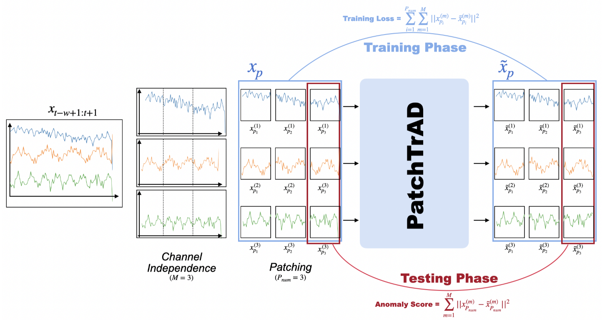
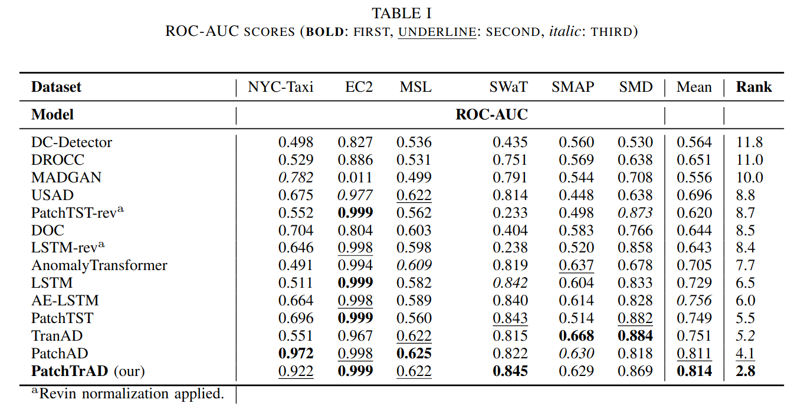
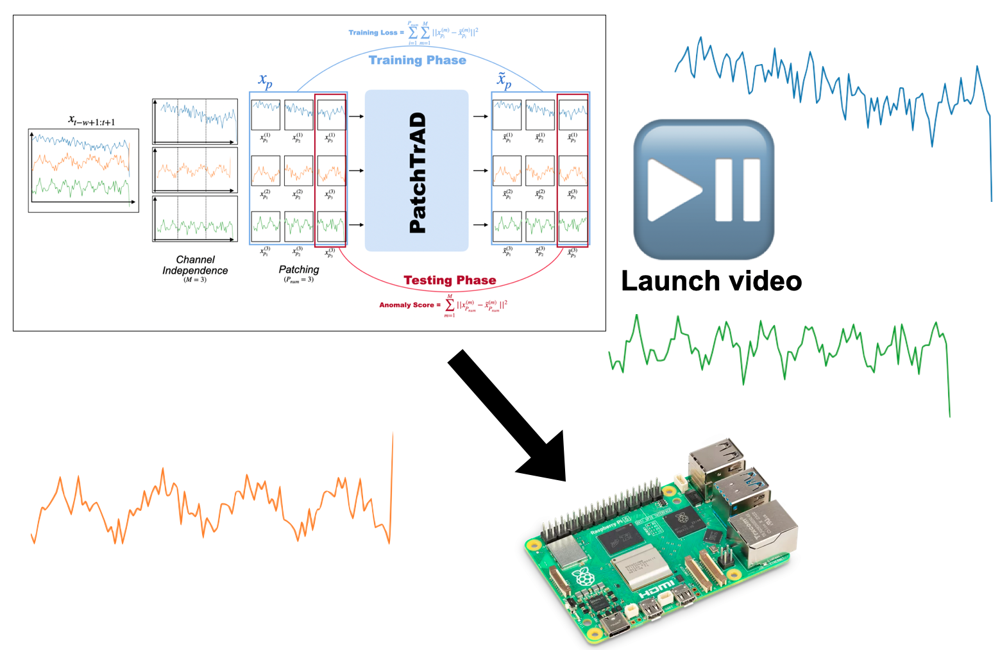

# PatchTrAD: A Transformer-Based Anomaly Detector Using Patch-Wise Reconstruction Error for Time Series

This repository contains the implementation of **PatchTrAD**, a Transformer-based anomaly detection model that leverages patch-wise reconstruction error for effective time series anomaly detection. The model is compatible with multiple datasets, including both univariate and multivariate time series.

---

## News ⭐
- **2025-05-20**: PatchTrAD has been accepted at [EUSIPCO 2025](https://arxiv.org/pdf/2504.08827) for an oral presentation. 
Slides and a poster can be found [here](https://github.com/vilhess/PatchTrAD/tree/main/files)

## Architecture Overview 🧠


## 🚀 Getting Started

### 1. Install Dependencies

```bash
pip install -r requirements.txt
```

### 2. Prepare the Datasets
To install the datasets, you can use the following command:
```bash
python dataset/preprocess.py
```
For the **SWaT** dataset, you need to claim the data from the [iTrust website](https://itrust.sutd.edu.sg/itrust-labs_datasets/dataset_info/) and place it in the `data/swat` directory. Files needed: SWaT_Dataset_Normal_v1.xlsx, SWaT_Dataset_Attack_v0.xlsx

### 3. Run the Model

#### Run on All Datasets

```bash
chmod +x ./run_models.sh
./run_models.sh
```

#### Run on a Specific Dataset

```bash
python main.py dataset=<dataset_name>
```

Replace `<dataset_name>` with one of the following:

- `nyc_taxi`
- `ec2_request_latency_system_failure`
- `smd`
- `smap`
- `msl`
- `swat`

> 📁 **Note:** Dataset-specific hyperparameters are located in the configuration folder: `conf/dataset`.

After training, results are saved to:  
```bash
results/results.json
```

---

## 📊 Datasets

### 🔹 Univariate

- **NYC Taxi Demand**  
  Location: `data/nab`

- **EC2 Request Latency (System Failure)**  
  Location: `data/nab`

Both datasets come from the [Numenta Anomaly Benchmark (NAB)](https://github.com/numenta/NAB/).

---

### 🔸 Multivariate

- **SWAT (Secure Water Treatment Testbed)**  
  Location: `data/swat`  
  Source: [iTrust, SUTD](https://itrust.sutd.edu.sg/itrust-labs_datasets/dataset_info/)

- **Server Machine Dataset (SMD)**  
  Location: `data/smd`  
  Source: [OmniAnomaly](https://github.com/NetManAIOps/OmniAnomaly)

- **SMAP & MSL (NASA Telemetry Data)**  
  Location: `data/nasa`  
  Source:  
  [Paper](https://arxiv.org/abs/1802.04431) | [GitHub](https://github.com/khundman/telemanom)

---


## Results

Note: Results may have changed since the time of writing. For the latest results, please refer to the `results` folder. Especially for NASA datasets where we changed the normalization method.
Considering other baselines, code implementations are available in the [DL4TSAD](https://github.com/vilhess/DL4TSAD) repository.

## PatchTrAD on a Raspberry Pi

<a href="https://youtube.com/shorts/pMysMPT5imI">
  
</a>

This demo (Youtube short) shows PatchTrAD running locally on a Raspberry Pi for real-time anomaly detection on time series data. Observations are send every 0.05 seconds from a simulated sensor stream, and the model processes this data in real-time. The system uses a green LED to indicate normal behavior and switches to a red LED when an anomaly is detected.  
It highlights how lightweight PatchTrAD can be deployed efficiently on edge devices, enabling local and responsive monitoring without needing cloud infrastructure.

### Features:
- Real-time data streaming and inference
- Low resource usage
- LED indicator for anomaly detection
- Compatible with Raspberry Pi 3/4

### How it works:
1. The Pi receives time series data from a sensor or simulated stream.
2. PatchTrAD processes incoming data in a sliding window.
3. During normal behaviour, a green led is running. If an anomaly is detected, the system triggers a red LED.
4. All computation is done locally on the Pi.

> ⚡ Ideal for IoT, predictive maintenance, and smart monitoring use cases.


## 📚 Citation

If you use this project in your research, please cite:

```
@misc{
      title={PatchTrAD: A Patch-Based Transformer focusing on Patch-Wise Reconstruction Error for Time Series Anomaly Detection}, 
      author={Samy-Melwan Vilhes and Gilles Gasso and Mokhtar Z Alaya},
      year={2025},
      eprint={2504.08827},
      archivePrefix={arXiv},
      primaryClass={cs.LG},
      url={https://arxiv.org/abs/2504.08827}, 
}
```